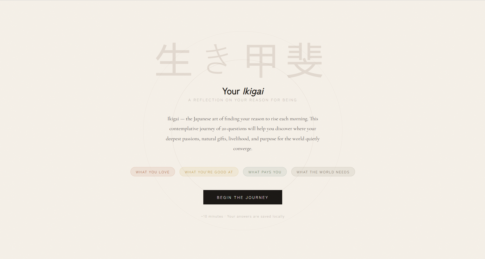

# 生き甲斐 · Ikigai — Discover Your Reason for Being

A contemplative, interactive web experience that guides users through the Japanese philosophy of Ikigai — the intersection of what you love, what you're good at, what the world needs, and what you can be paid for.



---

## ✨ What it is

**Ikigai** (生き甲斐) is a Japanese concept meaning *"reason for being"* — a framework for finding the convergence between passion, mastery, vocation, and mission. This project turns that philosophy into a thoughtful, aesthetic web experience.

- **20 carefully crafted questions** across three formats (multiple choice, Likert scale, emoji selection)
- **Interactive SVG Venn diagram** with personalised reflections per dimension
- **Score-adaptive synthesis** — results are genuinely different depending on your answers
- **Progress saved automatically** via `localStorage`
- **One-click social sharing** with a customisable message
- **Zero dependencies** — a single HTML file, deployable anywhere

---

## 🖼️ Design Philosophy

The visual language draws from **wabi-sabi** (侘寂) — the Japanese aesthetic of imperfection, impermanence, and quiet beauty:

- Earthy palette: terracotta, ochre, moss green, stone grey, ink black
- Typographic pairing: *Cormorant Garamond* (serif, reflective) + *Zen Kaku Gothic New* (sans, clear)
- Grain texture overlay and generous negative space
- No gamification, no noise — only calm, intentional interaction

---

## 🚀 Getting Started

### Option 1 — Open locally
```bash
git clone https://github.com/YOUR_USERNAME/ikigai.git
cd ikigai
open index.html   # macOS
# or: xdg-open index.html  (Linux)
# or: start index.html     (Windows)
```
No build step. No server needed. Just open `index.html` in any modern browser.

### Option 2 — Deploy to GitHub Pages
1. Fork this repository
2. Go to **Settings → Pages**
3. Set source to `main` branch, `/ (root)`
4. Your test will be live at `https://YOUR_USERNAME.github.io/ikigai`

### Option 3 — Deploy to Netlify
[](https://app.netlify.com/start/deploy?repository=https://github.com/YOUR_USERNAME/ikigai)

Simply drag the project folder into [app.netlify.com/drop](https://app.netlify.com/drop).

---

## 📁 Project Structure

```
ikigai/
├── index.html              # The complete application (HTML + CSS + JS)
├── README.md               # This file
├── LICENSE                 # MIT License
├── CONTRIBUTING.md         # How to contribute
├── CHANGELOG.md            # Version history
├── .github/
│   ├── ISSUE_TEMPLATE/
│   │   ├── bug_report.md
│   │   └── feature_request.md
│   └── PULL_REQUEST_TEMPLATE.md
└── docs/
    ├── preview.png         # Screenshot for README
    ├── ikigai-philosophy.md  # The philosophy behind the questions
    └── algorithm.md        # How scoring and synthesis work
```

---

## 🧠 The Philosophy Behind the Questions

Each question is designed to surface one of the four Ikigai dimensions **indirectly** — avoiding leading questions that telegraph the "right" answer. The methodology draws from:

- **Positive psychology** (Seligman's PERMA model, flow states, signature strengths)
- **Self-determination theory** (autonomy, competence, relatedness)
- **Ikigai-kan scale** (Imai et al., 2012) — validated Japanese psychological instrument
- **Narrative psychology** — questions about choices, environments, and imagined scenarios reveal values more accurately than direct self-assessment

See [`docs/ikigai-philosophy.md`](docs/ikigai-philosophy.md) for a deeper exploration.

---

## ⚙️ How Scoring Works

Each answer maps to a normalised value (0–1) for its Ikigai dimension:

| Question Type | Scoring |
|---|---|
| Multiple choice | Selected option value (1–4) → normalised to 0–0.33–0.66–1.0 |
| Likert (1–5) | Raw value → normalised to 0–0.25–0.5–0.75–1.0 |
| Emoji selection | Same as multiple choice |

**Dimension score** = average of all normalised answers in that dimension.

**Synthesis profile** is determined by the overall average and the strongest/weakest dimension, producing adaptive narrative text from a library of reflection passages.

See [`docs/algorithm.md`](docs/algorithm.md) for full technical documentation.

---

## 🌐 Browser Support

| Browser | Version |
|---|---|
| Chrome / Edge | 90+ |
| Firefox | 88+ |
| Safari | 14+ |
| Mobile Safari (iOS) | 14+ |
| Chrome for Android | 90+ |

---

## 🤝 Contributing

Contributions are warmly welcome — especially:

- **New question suggestions** with philosophical grounding
- **Translations** into other languages
- **Accessibility improvements** (ARIA labels, keyboard nav)
- **Design refinements** faithful to the wabi-sabi aesthetic

Please read [`CONTRIBUTING.md`](CONTRIBUTING.md) before opening a pull request.

---

## 📄 License

[MIT](LICENSE) — free to use, adapt, and share. A mention or link back is appreciated but not required.

---

## 🙏 Acknowledgements

- The concept of Ikigai as popularised in the West, drawing from Ken Mogi's *The Little Book of Ikigai* and Héctor García & Francesc Miralles' *Ikigai: The Japanese Secret to a Long and Happy Life*
- The original Japanese psychological research on Ikigai-kan (生き甲斐感) by Michiko Kumano and Tadanori Imai
- Wabi-sabi aesthetic principles as described by Leonard Koren in *Wabi-Sabi for Artists, Designers, Poets & Philosophers*

---

<p align="center">
  <em>"The place where your deep gladness meets the world's deep need."</em><br>
  — Frederick Buechner (a parallel Western formulation)
</p>